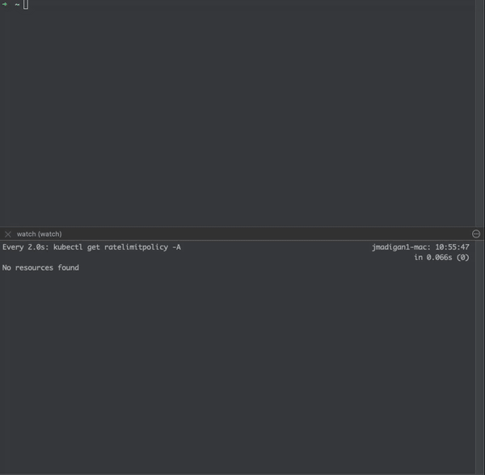

# Kuadrant MCP Server

A Model Context Protocol (MCP) server that generates Kuadrant policy manifests in YAML format. Designed to work alongside Kubernetes MCP servers like [mcp-server-kubernetes](https://github.com/Flux159/mcp-server-kubernetes) for applying resources to clusters.

## Demo



## Quick Start (Claude Code CLI)

```bash
# Add the MCP server using Docker (available in all projects)
claude mcp add kuadrant docker run -i --rm ghcr.io/kuadrant/kuadrant-mcp-server:latest -s user

# Verify installation
claude mcp list

# Start using
claude  # Start new session, type /mcp to see available servers
```

## Overview

This MCP server generates Kuadrant-specific Kubernetes manifests:
- Gateway resources with Kuadrant annotations
- HTTPRoute configurations
- Kuadrant policies (DNS, TLS, RateLimit, Auth)

All manifests are generated in YAML format, matching the actual Kuadrant CRD specifications.

## Installation

### Using Go
```bash
go install github.com/kuadrant/kuadrant-mcp-server@latest
```

### Using Docker

The server is available as a Docker image from GitHub Container Registry:

```bash
docker pull ghcr.io/kuadrant/kuadrant-mcp-server:latest
```

### Building from Source
```bash
git clone https://github.com/kuadrant/kuadrant-mcp-server
cd kuadrant-mcp-server
docker build -t kuadrant-mcp-server:latest .
```

## Usage

### Transport Options

The server supports multiple transport protocols:

1. **stdio** (default) - Standard input/output for CLI integration
2. **sse** - Server-Sent Events for web-based clients
3. **http** - Streamable HTTP for modern web applications

### Standalone

#### Using stdio transport (default)
```bash
kuadrant-mcp-server
```

#### Using SSE transport
```bash
kuadrant-mcp-server -transport sse -addr :8080
```

#### Using StreamableHTTP transport
```bash
kuadrant-mcp-server -transport http -addr :8080
```

### With Docker

Using the pre-built image from GitHub Container Registry:

#### stdio transport (default)
```bash
docker run -i --rm ghcr.io/kuadrant/kuadrant-mcp-server:latest
```

#### SSE transport
```bash
docker run -i --rm -p 8080:8080 ghcr.io/kuadrant/kuadrant-mcp-server:latest -transport sse -addr :8080
```

#### StreamableHTTP transport
```bash
docker run -i --rm -p 8080:8080 ghcr.io/kuadrant/kuadrant-mcp-server:latest -transport http -addr :8080
```

### With Docker Compose
```bash
docker-compose up
```

### MCP Client Configuration

#### For stdio transport (Claude Desktop, CLI tools)

Using the pre-built Docker image:
```json
{
  "mcpServers": {
    "kuadrant": {
      "command": "docker",
      "args": ["run", "-i", "--rm", "ghcr.io/kuadrant/kuadrant-mcp-server:latest"]
    }
  }
}
```

Or if running the binary directly:
```json
{
  "mcpServers": {
    "kuadrant": {
      "command": "/path/to/kuadrant-mcp-server"
    }
  }
}
```

#### For HTTP transports (web applications)
```json
{
  "mcpServers": {
    "kuadrant-mcp": {
      "url": "http://localhost:8080",
      "transport": "streamablehttp"  // or "sse" for SSE transport
    }
  }
}
```

## Available Resources

The MCP server provides comprehensive documentation and examples through resources:

### Documentation Resources
- `kuadrant://docs/gateway-api` - Gateway API overview and Kuadrant integration
- `kuadrant://docs/dnspolicy` - Complete DNSPolicy reference with examples
- `kuadrant://docs/ratelimitpolicy` - RateLimitPolicy patterns and advanced usage
- `kuadrant://docs/authpolicy` - AuthPolicy authentication and authorization methods
- `kuadrant://docs/tlspolicy` - TLSPolicy certificate management guide

### Example Resources
- `kuadrant://examples/basic-setup` - Simple API with rate limiting and API key auth
- `kuadrant://examples/production-setup` - Full production setup with TLS, DNS, JWT auth

### Troubleshooting
- `kuadrant://troubleshooting` - Common issues, debugging techniques, and solutions

Access these resources in Claude by asking questions like:
- "Show me the Kuadrant rate limiting documentation"
- "How do I set up production TLS with Kuadrant?"
- "Help me troubleshoot my AuthPolicy not working"

**Note**: Claude may not always use resources automatically. To ensure resource usage:
- Be specific about wanting documentation or examples
- Reference Kuadrant policies by name (e.g., "RateLimitPolicy", "AuthPolicy")
- Ask for "complete examples" or "troubleshooting guide"

## Available Tools

### `create_gateway`
Generate a Gateway manifest with Kuadrant annotations.

**Arguments:**
- `name` (required): Gateway name
- `namespace` (required): Namespace
- `gatewayClassName`: Gateway class (default: "istio")
- `listeners`: Array of listener configurations
- `kuadrantEnabled`: Enable Kuadrant annotations (default: true)

**Example Output:**
```yaml
apiVersion: gateway.networking.k8s.io/v1
kind: Gateway
metadata:
  annotations:
    kuadrant.io/policy: enabled
  name: prod-gateway
  namespace: production
spec:
  gatewayClassName: istio
  listeners:
  - name: https
    port: 443
    protocol: HTTPS
    hostname: "*.example.com"
```

### `create_httproute`
Generate an HTTPRoute manifest.

**Arguments:**
- `name` (required): Route name
- `namespace` (required): Namespace
- `parentRefs` (required): Parent gateway references
- `hostnames`: List of hostnames
- `rules`: Routing rules

**Example Output:**
```yaml
apiVersion: gateway.networking.k8s.io/v1
kind: HTTPRoute
metadata:
  name: api-route
  namespace: production
spec:
  parentRefs:
  - name: prod-gateway
  hostnames:
  - api.example.com
  rules:
  - matches:
    - path:
        type: PathPrefix
        value: /api
    backendRefs:
    - name: api-service
      port: 8080
```

### `create_dnspolicy`
Generate a Kuadrant DNSPolicy manifest.

**Arguments:**
- `name` (required): Policy name
- `namespace` (required): Namespace
- `targetRef` (required): Target resource reference
- `providerRefs` (required): DNS provider references
- `loadBalancing`: Load balancing configuration
- `healthCheck`: Health check configuration

**Example Output:**
```yaml
apiVersion: kuadrant.io/v1
kind: DNSPolicy
metadata:
  name: prod-dns
  namespace: production
spec:
  targetRef:
    group: gateway.networking.k8s.io
    kind: Gateway
    name: prod-gateway
  providerRefs:
  - name: aws-dns-credentials
  loadBalancing:
    defaultGeo: true
    weight: 100
    geo: US
  healthCheck:
    path: /health
    failureThreshold: 3
    interval: 5min
```

### `create_tlspolicy`
Generate a Kuadrant TLSPolicy manifest (v1alpha1).

**Arguments:**
- `name` (required): Policy name
- `namespace` (required): Namespace
- `targetRef` (required): Target resource reference
- `issuerRef` (required): Certificate issuer reference
- `commonName`: Certificate common name
- `duration`: Certificate duration
- `renewBefore`: Renew before expiry

**Example Output:**
```yaml
apiVersion: kuadrant.io/v1alpha1
kind: TLSPolicy
metadata:
  name: prod-tls
  namespace: production
spec:
  targetRef:
    group: gateway.networking.k8s.io
    kind: Gateway
    name: prod-gateway
  issuerRef:
    group: cert-manager.io
    kind: ClusterIssuer
    name: letsencrypt-prod
  commonName: "*.example.com"
  duration: 90d
  renewBefore: 15d
```

### `create_ratelimitpolicy`
Generate a Kuadrant RateLimitPolicy manifest.

**Arguments:**
- `name` (required): Policy name
- `namespace` (required): Namespace
- `targetRef` (required): Target resource reference
- `limits`: Rate limit configurations (each limit must have a `rates` array with `limit` and `window` fields)
- `defaults`: Default rate limits
- `overrides`: Override rate limits

**Important:** Rate limits must use the format:
```json
{
  "limit-name": {
    "rates": [
      {
        "limit": 100,
        "window": "60s"  // Use time units: s, m, h (e.g., "10s", "5m", "1h")
      }
    ]
  }
}
```

**Example Output:**
```yaml
apiVersion: kuadrant.io/v1
kind: RateLimitPolicy
metadata:
  name: api-limit
  namespace: production
spec:
  targetRef:
    group: gateway.networking.k8s.io
    kind: HTTPRoute
    name: api-route
  limits:
    "global":
      rates:
      - limit: 5
        window: 10s
    "per-user":
      rates:
      - limit: 2
        window: 10s
      when:
      - predicate: "auth.identity.userid == 'bob'"
```

### `create_authpolicy`
Generate a Kuadrant AuthPolicy manifest.

**Arguments:**
- `name` (required): Policy name
- `namespace` (required): Namespace
- `targetRef` (required): Target resource reference
- `rules`: Authentication and authorization rules
- `defaults`: Default auth rules
- `overrides`: Override auth rules

**Example Output:**
```yaml
apiVersion: kuadrant.io/v1
kind: AuthPolicy
metadata:
  name: api-auth
  namespace: production
spec:
  targetRef:
    group: gateway.networking.k8s.io
    kind: HTTPRoute
    name: api-route
  rules:
    authentication:
      jwt-auth:
        jwt:
          issuerUrl: https://auth.example.com
    authorization:
      api-users:
        opa:
          rego: |
            allow = true {
              input.auth.identity.groups[_] == "api-users"
            }
```

## Kubernetes Integration

For a complete Kubernetes workflow, you can combine this server with the Kubernetes MCP server.

### Installing Kubernetes MCP Server

```bash
# Install globally
npm install -g @flux159/mcp-server-kubernetes

# Or use directly with npx
npx @flux159/mcp-server-kubernetes
```

The Kubernetes MCP server will:
- Automatically use your `~/.kube/config`
- Connect to your current kubectl context
- Provide tools for managing Kubernetes resources

### Configuration

#### Claude Desktop

Edit `~/Library/Application Support/Claude/claude_desktop_config.json`:

Using Docker (recommended):
```json
{
  "mcpServers": {
    "kuadrant": {
      "command": "docker",
      "args": ["run", "-i", "--rm", "ghcr.io/kuadrant/kuadrant-mcp-server:latest"]
    },
    "kubernetes": {
      "command": "npx",
      "args": ["@flux159/mcp-server-kubernetes"]
    }
  }
}
```

Or using the binary directly:
```json
{
  "mcpServers": {
    "kuadrant": {
      "command": "/path/to/kuadrant-mcp-server"
    },
    "kubernetes": {
      "command": "npx",
      "args": ["@flux159/mcp-server-kubernetes"]
    }
  }
}
```

#### Claude Code CLI

```bash
# Add Kuadrant server
claude mcp add kuadrant /path/to/kuadrant-mcp-server -s user

# Add Kubernetes server
claude mcp add kubernetes npx @flux159/mcp-server-kubernetes -s user
```

### Safe Mode

To prevent destructive operations, run the Kubernetes server in safe mode:

```bash
# In Claude Desktop config:
{
  "mcpServers": {
    "kubernetes": {
      "command": "npx",
      "args": ["@flux159/mcp-server-kubernetes"],
      "env": {
        "ALLOW_ONLY_NON_DESTRUCTIVE_TOOLS": "true"
      }
    }
  }
}

# Or with Claude Code CLI:
ALLOW_ONLY_NON_DESTRUCTIVE_TOOLS=true npx @flux159/mcp-server-kubernetes
```

### Example Workflow

With both servers configured, you can:

1. **Generate and Deploy**:
   ```
   Create a production gateway using Kuadrant and deploy it to my Kubernetes cluster
   ```

2. **Create Complete Setup**:
   ```
   Create a Gateway with TLS and rate limiting policies, then apply them all to the production namespace in my Kubernetes cluster
   ```

3. **Check Status**:
   ```
   Show me all Gateways and their associated Kuadrant policies in my Kubernetes cluster
   ```

### Real Example

```
User: Create a production API gateway with HTTPS and rate limiting, then deploy it
```

Assistant will:
1. Use kuadrant MCP to generate Gateway manifest
2. Use kuadrant MCP to generate RateLimitPolicy
3. Use kubernetes MCP to apply both manifests
4. Use kubernetes MCP to verify deployment status

## Complete Example Workflow

Here's a complete example setting up a Gateway with all policies:

1. **Generate Gateway**
```yaml
# Generated output:
apiVersion: gateway.networking.k8s.io/v1
kind: HTTPRoute
metadata:
  name: api-route
  namespace: production
spec:
  parentRefs:
  - name: api-gateway
  hostnames:
  - api.example.com
  rules:
  - matches:
    - path:
        type: PathPrefix
        value: /v1
    backendRefs:
    - name: api-v1
      port: 8080
```

3. **Generate DNSPolicy**
```yaml
# Generated output:
apiVersion: kuadrant.io/v1
kind: DNSPolicy
metadata:
  name: api-dns
  namespace: production
spec:
  targetRef:
    group: gateway.networking.k8s.io
    kind: Gateway
    name: api-gateway
  providerRefs:
  - name: route53-credentials
```

4. **Generate RateLimitPolicy**
```yaml
# Generated output:
apiVersion: kuadrant.io/v1
kind: RateLimitPolicy
metadata:
  name: api-ratelimit
  namespace: production
spec:
  targetRef:
    group: gateway.networking.k8s.io
    kind: HTTPRoute
    name: api-route
  limits:
    "global":
      rates:
      - limit: 10
        window: 60s
```

5. **Generate AuthPolicy**
```yaml
# Generated output:
apiVersion: kuadrant.io/v1
kind: AuthPolicy
metadata:
  name: api-auth
  namespace: production
spec:
  targetRef:
    group: gateway.networking.k8s.io
    kind: HTTPRoute
    name: api-route
  rules:
    authentication:
      jwt:
        jwt:
          issuerUrl: https://auth.example.com/realms/api
```

## API Version Reference

- Gateway/HTTPRoute: `gateway.networking.k8s.io/v1`
- DNSPolicy: `kuadrant.io/v1`
- TLSPolicy: `kuadrant.io/v1alpha1`
- RateLimitPolicy: `kuadrant.io/v1`
- AuthPolicy: `kuadrant.io/v1`

## Building from Source

```bash
git clone https://github.com/kuadrant/kuadrant-mcp-server
cd kuadrant-mcp-server
go build -o kuadrant-mcp-server
```


## Claude Code CLI Setup

To use this server with Claude Code CLI:

### Option 1: Using Docker (Recommended)

```bash
# Add using Docker image
claude mcp add kuadrant docker run -i --rm ghcr.io/kuadrant/kuadrant-mcp-server:latest -s user

# Verify installation
claude mcp list

# Start using
claude  # Start new session, type /mcp to see available servers
```

### Option 2: Using Local Binary

1. **Build the server**
   ```bash
   go build -o kuadrant-mcp-server
   ```

2. **Add to Claude Code**
   ```bash
   claude mcp add kuadrant /path/to/kuadrant-mcp-server
   ```

   For example:
   ```bash
   claude mcp add kuadrant /Users/yourusername/kuadrant-mcp-server/kuadrant-mcp-server
   ```

3. **Verify installation**
   ```bash
   claude mcp list
   ```

4. **Test in Claude**
   Start a new Claude session and type:
   ```
   /mcp
   ```
   
   You should see "kuadrant" listed. Then try:
   ```
   Create a Gateway manifest named 'test-gateway' in namespace 'default'
   ```

### Troubleshooting

If `/mcp` shows "No MCP servers configured":
- Make sure you're in the same directory where you ran `claude mcp add` (for project/local scope)
- The MCP configuration scopes are:
  - `local`: Private to you in the current project (default)
  - `user`: Available to you in all projects
  - `project`: Shared with all users in the current project
- Try adding with the full absolute path
- Check the server is executable: `chmod +x kuadrant-mcp-server`
- Start a new Claude session after adding the server

### Enable Logging (Optional)

To see when Claude uses your MCP server:

1. Use the logging wrapper script:
   ```bash
   chmod +x run_with_logging.sh
   claude mcp remove kuadrant -s local
   claude mcp add kuadrant /path/to/kuadrant-mcp-server/run_with_logging.sh
   ```

2. Monitor the logs:
   ```bash
   tail -f /tmp/kuadrant-mcp.log
   ```

### Testing Your Installation

After setting up the MCP server, test it with these commands in Claude:

1. **Verify MCP tools are available** in Claude:
   ```
   /mcp
   ```
   
   You should see "kuadrant" listed. Then check what tools it provides:
   ```
   What tools does the kuadrant MCP server provide?
   ```

2. **Monitor the logs** (in a separate terminal):
   ```bash
   tail -f /tmp/kuadrant-mcp.log
   ```

3. **Test with natural language commands** in Claude:

   ```
   # Gateway creation
   Create a Kuadrant Gateway named 'api-gateway' in the 'gateway-system' namespace with HTTPS enabled and apply this in my Kubernetes cluster with the kubernetes tool

   # HTTPRoute creation  
   Create an HTTPRoute named 'api-routes' in namespace 'gateway-system' that routes traffic from gateway 'api-gateway' to service 'api-backend' on port 8080 and apply this in my Kubernetes cluster with the kubernetes tool

   # Rate limiting
   Create a RateLimitPolicy that limits requests to 100 per minute for the HTTPRoute 'api-routes' in namespace 'gateway-system' and apply this in my Kubernetes cluster with the kubernetes tool

   # Per-user rate limiting
   Create a RateLimitPolicy for HTTPRoute 'api-routes' that allows 5 requests per 10 seconds for user 'alice' and 2 requests per 10 seconds for user 'bob' and apply this in my Kubernetes cluster with the kubernetes tool

   # Authentication
   Create an AuthPolicy for HTTPRoute 'api-routes' that requires JWT authentication from issuer 'https://auth.example.com' and apply this in my Kubernetes cluster with the kubernetes tool

   # DNS management
   Create a DNSPolicy for gateway 'api-gateway' using AWS Route53 credentials 'route53-creds' with multi-region load balancing and apply this in my Kubernetes cluster with the kubernetes tool

   # TLS certificates
   Create a TLSPolicy for gateway 'api-gateway' using Let's Encrypt to get a wildcard certificate for '*.example.com' and apply this in my Kubernetes cluster  with the kubernetes tool
   ```

   **With Kubernetes integration:**
   ```
   Create a production API gateway with rate limiting of 50 requests per minute and deploy it to my Kubernetes cluster with the kubernetes tool

   Generate a complete Kuadrant setup with Gateway, HTTPRoute, rate limiting, and JWT auth for my API, then apply it to the 'gateway-system' namespace in my Kubernetes cluster with the kubernetes tool
   ```

4. **Common real-world scenarios**:

   **E-commerce API protection:**
   ```
   I need to protect my e-commerce API. Create a Gateway with rate limiting that allows regular users 100 requests per minute but gives premium users 1000 requests per minute and apply this in my Kubernetes cluster
   ```

   **Multi-tenant SaaS platform:**
   ```
   Set up a Gateway for my SaaS platform with different rate limits per tenant: 
   - Free tier: 10 requests per minute
   - Pro tier: 100 requests per minute
   - Enterprise: unlimited
   Then apply this configuration to my Kubernetes cluster
   ```

   **Public API with authentication:**
   ```
   Create a public API gateway that requires API key authentication and limits each API key to 50 requests per second and deploy it to my Kubernetes cluster
   ```

   **Complete production setup:**
   ```
   Set up a production-ready API gateway with:
   - HTTPS using Let's Encrypt certificates
   - JWT authentication from Auth0
   - Rate limiting of 1000 requests per hour per user
   - DNS managed by Route53
   Then deploy everything to my Kubernetes cluster
   ```

5. **What you should see in the logs**:
   ```
   [KUADRANT MCP] Starting server with transport=stdio
   [KUADRANT MCP] create_gateway called with name=api-gateway, namespace=production
   [KUADRANT MCP] create_httproute called with name=api-route, namespace=production
   [KUADRANT MCP] create_ratelimitpolicy called with name=api-route, namespace=production
   ```

If you don't see logs:
- Type `/mcp` in Claude - verify "kuadrant" is listed
- Make sure you started a new Claude session after adding the server
- Try being more explicit: "Use the kuadrant MCP server to create a Gateway"

### Common Issues

**RateLimitPolicy format errors:**

If you get errors like "unknown field spec.limits.xxx.rates[0].duration", make sure your rate limits use the correct format:

✅ **Correct:**
```yaml
rates:
- limit: 100
  window: 60s    # or "1m", "5m", "1h", etc.
```

❌ **Incorrect:**
```yaml
rates:
- limit: 100
  duration: 60
  unit: second
```


## Updating Documentation

The server includes embedded documentation from the official Kuadrant repositories. To update to the latest docs:

```bash
# Extract latest documentation from source repos
./update-docs.sh

# (Optional) Generate Go code from the extracted docs
go run process-docs.go

# Review and integrate changes as needed
```

The update script:
- Reads the mkdocs.yml configuration from docs.kuadrant.io
- Extracts only the files actually published on the docs site
- Preserves the original directory structure
- Creates a summary of all extracted files

For more details, see [UPDATE_DOCS.md](UPDATE_DOCS.md).

## MCP Configuration

To use this server with an MCP client (like Claude Desktop), add it to your MCP configuration:

Using the pre-built Docker image:
```json
{
  "mcpServers": {
    "kuadrant": {
      "command": "docker",
      "args": ["run", "-i", "--rm", "ghcr.io/kuadrant/kuadrant-mcp-server:latest"]
    }
  }
}
```

Or if running the binary locally:
```json
{
  "mcpServers": {
    "kuadrant": {
      "command": "/path/to/kuadrant-mcp-server"
    }
  }
}
```

## License

Apache 2.0
